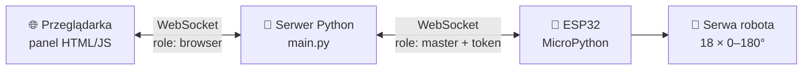

<h1 align="center">🤖 Webowy panel sterowania robotem kroczącym</h1>

<p align="center">
  <b>Praca inżynierska</b> · Informatyka Stosowana · Politechnika Bydgoska
</p>

<p align="center">
  
  
  
  
  
  
</p>

<p align="center">
  System do zdalnego sterowania robotem kroczącym z przeglądarki.<br>
  Serwer w Pythonie pośredniczy w komunikacji WebSocket między interfejsem webowym a mikrokontrolerem ESP32.
</p>

---

## ✨ Funkcje

| | Moduł | Opis |
|:-:|---|---|
| 🔐 | **Autoryzacja ESP32** | Robot łączy się z serwerem i uwierzytelnia tokenem. Panel odblokowuje się dopiero po potwierdzeniu połączenia |
| 🎛️ | **Sterowanie serwami** | 18 suwaków (0–180°) do ręcznego ustawiania każdego serwa – 6 nóg × 3 stawy |
| 🕹️ | **Sterowanie strzałkami** | Ruch przód / tył / lewo / prawo przyciskami lub klawiaturą (strzałki, WASD) |
| 🧩 | **Programowanie blokowe** | Edytor **Blockly** z polskimi blokami („Idź do przodu o N”, „Skręć w lewo”) do układania sekwencji ruchów |
| 📡 | **Status na żywo** | Przeglądarka dostaje informacje o połączeniu, autoryzacji i rozłączeniu robota w czasie rzeczywistym |

---

## 🏗️ Architektura



**Przepływ komunikacji:**
1. Przeglądarka łączy się z serwerem jako `browser` i czeka na robota
2. ESP32 łączy się jako `master` i wysyła token autoryzacyjny
3. Po poprawnej autoryzacji serwer wysyła do przeglądarki `{"status": "authorized"}` → przekierowanie do menu
4. Polecenia z panelu (`{"type": "slider", ...}`) trafiają przez serwer do ESP32
5. Komunikaty statusowe z ESP32 wracają do przeglądarki

---

## 🗂️ Struktura projektu

| Plik | Rola |
|---|---|
| `main.py` | Główny serwer: HTTP (pliki statyczne) + WebSocket (routing komunikatów, autoryzacja) |
| `server.py` | Alternatywna wersja serwera na **FastAPI** + Uvicorn (wersja rozwojowa) |
| `test.py` | Skrypt symulujący połączenie ESP32 – do testów bez fizycznego robota |
| `index.html` | Ekran startowy: status połączenia i oczekiwanie na autoryzację |
| `menu.html` | Menu wyboru trybu sterowania |
| `test_serw.html` | Panel z 18 suwakami do sterowania serwami |
| `strzalki.html` | Sterowanie kierunkowe |
| `puzzle.html` | Edytor programowania blokowego Blockly |

---

## 🚀 Uruchomienie

```bash
git clone https://github.com/agvg8/Praca_inzynierska.git
cd Praca_inzynierska
pip install -r requirements.txt
python main.py
```

Panel będzie dostępny pod adresem **http://localhost:8080**.

**Test bez robota** – w drugim terminalu uruchom symulator ESP32:
```bash
python test.py
```
Strona powinna przejść ze stanu „Oczekiwanie na autoryzację” do menu.

---

## 🛠️ Technologie

- **Backend:** Python, `asyncio`, `websockets`, `http.server` (wersja alternatywna: FastAPI + Uvicorn)
- **Frontend:** HTML, CSS, JavaScript, Google Blockly
- **Sprzęt:** ESP32 z MicroPython, serwomechanizmy
- **Protokół:** WebSocket z komunikatami JSON
